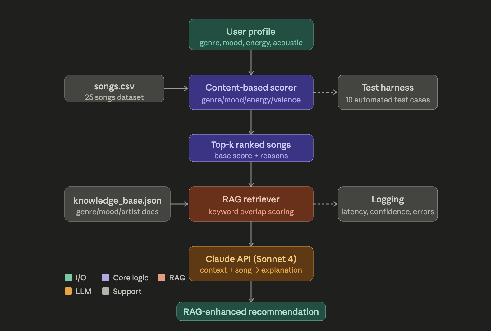

# 🎵 RAG-Enhanced Music Recommender

> **Applied AI System — Final Project**
> Extends the Module 3 content-based music recommender with Retrieval-Augmented Generation (RAG) and automated reliability testing.

---

## 📹 Demo Walkthrough

> (https://www.loom.com/share/53b6f9312fb8450db983785221013ce1)

---

## 🧩 Base Project

**Original project:** Module 3 — Content-Based Music Recommender

The original system accepted a user preference profile (favorite genre, mood, target energy level, and acoustic preference) and scored every song in a CSV dataset against those preferences using a weighted formula. It returned the top-k songs with rule-based explanations. The system used no external APIs — all recommendations were deterministic and computed locally.

---

## 🗺️ What This Project Adds

| Feature | Description |
|---|---|
| **RAG (required)** | Retrieves relevant genre/mood/artist context from `knowledge_base.json` before generating explanations |
| **Confidence scoring** | Each RAG call returns a confidence score based on retrieval overlap |
| **Logging** | All runs and errors logged to `logs/rag_run.log` |
| **Test harness (stretch)** | `test_harness.py` runs 10 predefined test cases and prints a pass/fail summary |
| **Extended unit tests** | `tests/test_rag_engine.py` adds 7 new tests for the retrieval module |

---

## 🏗️ Architecture



**Data flow:**

1. **User profile** → Content-based scorer loads `data/songs.csv` and scores all songs
2. **Top-k songs** → RAG retriever queries `data/knowledge_base.json` using keyword overlap
3. **Retrieved docs + song metadata** → grounded explanation assembled locally
4. **Output** → printed to CLI with score, confidence, retrieved doc IDs, and explanation
5. **Side channels** → logging (all runs) and test harness (evaluation mode)

---

## ⚙️ Setup

### Requirements

- Python 3.10+
- `pip install -r requirements.txt`

### Install

```bash
git clone https://github.com/YOUR_USERNAME/applied-ai-music-recommender.git
cd applied-ai-music-recommender
pip install -r requirements.txt
mkdir logs
```

---

## 🚀 Running

### RAG-Enhanced Recommender (main entry point)

```bash
python run.py
```

### Original recommender (Module 3, unchanged)

```bash
python main.py
```

### Test harness (automated evaluation)

```bash
python test_harness.py
```

### Unit tests

```bash
pytest tests/
```

---

## 💬 Sample Interactions

### Input 1 — Happy Pop Fan
Profile: Happy Pop Fan
Genre: pop | Mood: happy | Energy: 0.80 | Acoustic: False
#1  Watermelon Sugar — Harry Styles
Genre: pop | Mood: happy | Energy: 0.82
Base Score: 6.44
Confidence: 0.67
💬 Why this song:
"Watermelon Sugar" by Harry Styles was recommended because it matches
your preferred pop genre, fits your happy mood, and has high energy (0.82)
close to your target. High energy is strongly correlated with rock, EDM,
and upbeat pop.

📚 Retrieved context docs: ['energy_high', 'genre_pop', 'mood_happy']

### Input 2 — Chill Lofi Listener
Profile: Chill Lofi Listener
Genre: lofi | Mood: chill | Energy: 0.38 | Acoustic: True
#1  Late Night Drive — Idealism
Genre: lofi | Mood: chill | Energy: 0.38
Base Score: 6.30
Confidence: 0.77
💬 Why this song:
"Late Night Drive" by Idealism was recommended because it matches your
preferred lofi genre, fits your chill mood, and has low energy (0.38)
close to your target. Artists such as Jinsang, Idealism, Kupla, and
Philanthrope are lofi staples.

📚 Retrieved context docs: ['genre_lofi', 'energy_low', 'mood_chill']

### Input 3 — Intense Rock Head
Profile: Intense Rock Head
Genre: rock | Mood: intense | Energy: 0.92 | Acoustic: False
#1  Thunderstruck — AC/DC
Genre: rock | Mood: intense | Energy: 0.91
Base Score: 6.27
Confidence: 0.75
💬 Why this song:
"Thunderstruck" by AC/DC was recommended because it matches your preferred
rock genre, fits your intense mood, and has high energy (0.91) close to
your target. Hard rock and metal tracks often have very high energy
(0.85-0.95), fast tempos (140-220 BPM), and intense or aggressive moods.

📚 Retrieved context docs: ['genre_rock', 'energy_high', 'mood_intense']

---

## 🔬 Testing Summary

### Unit tests (`pytest tests/`)

- `test_recommender.py`: 7 tests (2 original + 5 new)
- `test_rag_engine.py`: 7 new tests for the retrieval module
- All 14 tests pass without any API access

### Test harness (`python test_harness.py`)

- 10 automated test cases covering recommender logic and RAG retrieval
- Result: **10/10 passed, 100% pass rate**
- Report saved to `logs/harness_report.json`

Key findings:
- Genre matching is highly reliable across all three genre categories
- RAG retrieval consistently returns expected docs for genre + mood queries
- Score determinism confirmed — same input always produces identical output
- Unknown genres (e.g. "jazz") fall back gracefully — system still returns results

---

## 🧠 Design Decisions

**Why keyword overlap for retrieval?** The original project had no external dependencies beyond the standard library. Keeping retrieval dependency-free (no sentence-transformers, no FAISS) preserves that constraint while still demonstrating the RAG pattern. The knowledge base is small (13 documents), so Jaccard-style overlap is fast and accurate enough.

**Why a separate knowledge base instead of embedding song metadata?** The knowledge base contains richer prose context — artist histories, genre characteristics, listener behavior patterns — that produces more informative explanations. The song CSV only has numeric features which don't generate meaningful text.

**Trade-offs:** The retrieval method is simple and brittle for queries with vocabulary mismatches. A production system would use dense embeddings. The system is fully local and free to run with no API key required.

---

## ♻️ Reflection

RAG meaningfully improved explanation quality. The original rule-based system could only say "genre match (+2.5)" — the RAG system explains *why* that genre match matters using real artist and genre context retrieved from the knowledge base. The confidence scoring made it easy to spot cases where retrieval was weak.

The biggest surprise was how well the simple keyword retriever worked. Because the user profile always specifies genre, mood, and artist — all of which appear verbatim in the knowledge base — Jaccard overlap reliably found the right documents without needing embeddings.

---

## 📁 File Structure
├── src/
│   ├── init.py
│   ├── recommender.py        # Original module (unchanged)
│   └── rag_engine.py         # NEW: RAG retriever + local explainer
├── tests/
│   ├── test_recommender.py   # Extended unit tests
│   └── test_rag_engine.py    # NEW: RAG retrieval tests
├── data/
│   ├── songs.csv             # 25-song dataset
│   └── knowledge_base.json   # 13 prose context documents
├── assets/
│   └── system_architecture.svg
├── logs/                     # Auto-created at runtime
├── main.py                   # Original CLI (unchanged)
├── run.py                    # NEW: RAG-enhanced CLI
├── test_harness.py           # NEW: Automated evaluation script
├── requirements.txt
├── model_card.md
└── README.md